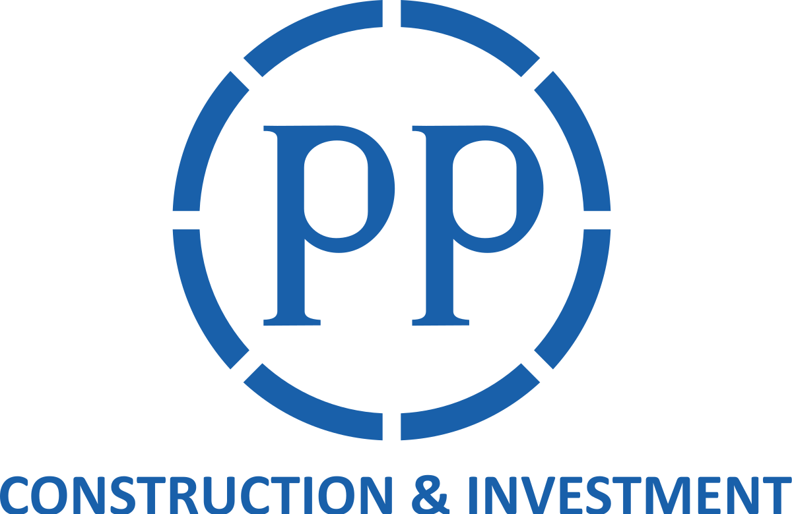

.. PP Financial Dashboard API Services documentation master file, created by
   sphinx-quickstart on Fri Dec  3 09:32:14 2021.
   You can adapt this file completely to your liking, but it should at least
   contain the root `toctree` directive.

Pengembangan Kemlu 2022
===================================

Pengembangan Kemlu 2022 merupakan sebuah projek lanjutan......  kecepatan.
ayo dong. yuk yak yuk

Panduan Pengguna
----------------

Bagian dokumentasi ini dimulai dengan beberapa informasi untuk persyaratan, instalasi, dan konfigurasi. Kemudian fokus pada langkah demi langkah
instruksi untuk menggunakan PP Financial Dashboard API Services.

.. toctree::
   :maxdepth: 2

   pages/project-structure
   pages/requirement
   pages/installation-and-configuration
   pages/swagger

Versi Berjalan
--------------

* Go: 1.16 darwin/amd64

Tautan Terkait
--------------

* Dokumentasi Golang: https://go.dev/doc/
* Dokumentasi Echo Framework: https://echo.labstack.com/guide/
* Source code: https://dev.azure.com/pt-pp/ppit-mantapp/_git/ppit-mantap-api